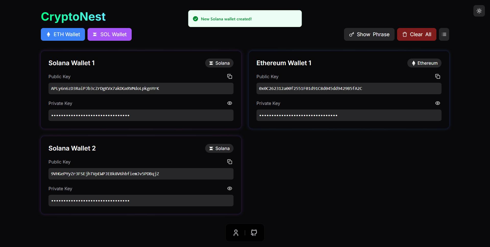

# CryptoNest Wallet

## 🌍 Live Demo

🔗 [CryptoNest Wallet](https://crypto-nest-wallet.vercel.app/)

## 🚀 Overview

CryptoNest Wallet is a secure and user-friendly cryptocurrency wallet built with **Next.js**. It allows users to generate or import seed phrases, create **Solana** and **Ethereum** accounts, and track balances in real time. Designed for seamless multi-chain asset management, CryptoNest Wallet ensures a smooth and intuitive experience for crypto users.

## 🌟 Features

- **Secure Seed Phrase Management:** Users can generate a new seed phrase or import an existing one.
- **Multi-Chain Support:** Create and manage **Solana** and **Ethereum** wallets effortlessly.
- **Real-Time Balance Tracking:** View balances for each specific account.
- **Intuitive UI:** A clean and responsive dashboard for seamless navigation.
- **Fast & Lightweight:** Built with Next.js for high performance and fast loading speeds.

## 📸 Screenshots

### 🔹 Landing Page


### 🔹 Generating or Importing a Seed Phrase


### 🔹 Wallets Dashboard



### 🔹 Wallet UI with Balance Tracking


## 🛠️ Tech Stack

-   Next.js, Tailwind CSS
- **Blockchain Integration:** Web3.js, Solana Web3.js
- **Hosting:** Vercel

## 🔧 Installation & Setup

1. **Clone the Repository:**
   ```sh
   git clone https://github.com/DHANUNJAY965/CryptoNest-Wallet.git
   cd CryptoNest-Wallet
   ```
2. **Install Dependencies:**
   ```sh
   npm install
   ```
3. **Run the Development Server:**
   ```sh
   npm run dev
   ```
4. Open [http://localhost:3000](http://localhost:3000) in your browser.

## 🌍 Live Demo

🔗 [CryptoNest Wallet](https://crypto-nest-wallet.vercel.app/)

## 📜 License

This project is open-source and available under the MIT License.


Feel free to fork, contribute, and enhance **CryptoNest Wallet**! 🚀

